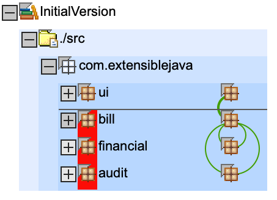
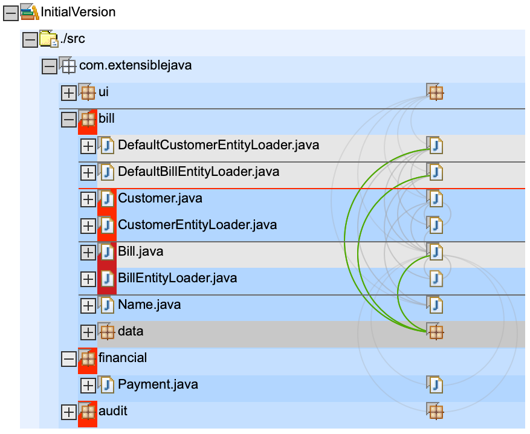
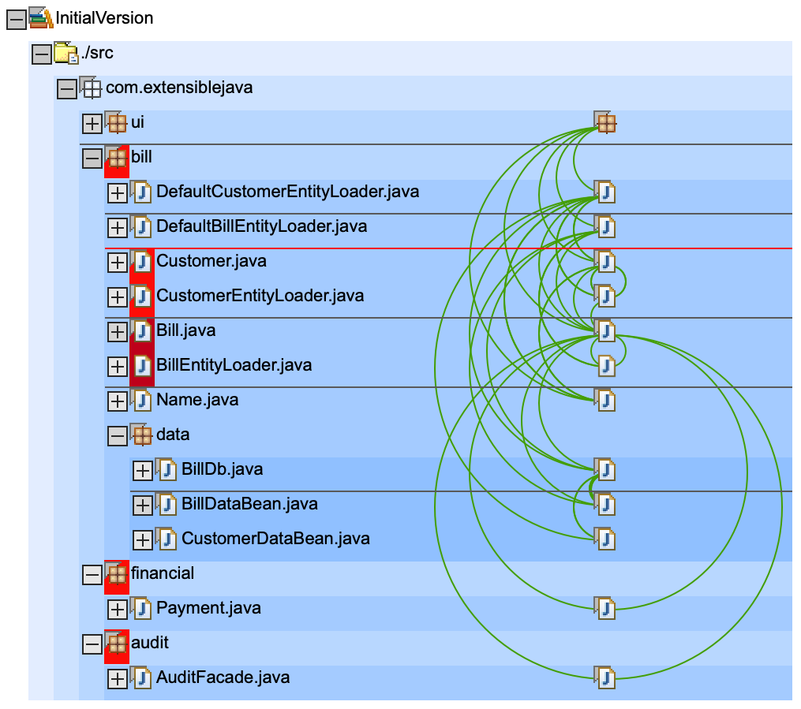

# Dependencys

[Sonargraph](https://www.hello2morrow.com/products/sonargraph) shows the cycles between packages `bill <-> financial` and `bill <-> audit` (green half circle on the right) that are in this 'InitialVersion'.

Other dependencys are fine:
* `ui` is top package that uses/sees other (lower) package `bill`
* `bill.data` is inner package of `bill` that is only used by outer package `bill`

Here we see who uses `data` package:

Here we see that the cycles between `bill <-> financial` and `bill <-> audit` are caused by class `Bill.java` in `bill`.

# Artefact

Please note: All classes are bundled in one big war file

    ~ git:(master) ✗ jar tf InitialVersion/deploy/billpay.war
    META-INF/
    META-INF/MANIFEST.MF
    WEB-INF/
    WEB-INF/web.xml
    BillDetail.jsp
    CustomerBills.jsp
    search.jsp
    WEB-INF/lib/
    WEB-INF/app.tld
    WEB-INF/lib/struts.jar        <<< WEB-INF/lib only contains struts.jar
    WEB-INF/struts-bean.tld
    WEB-INF/struts-config.xml
    WEB-INF/struts-form.tld
    WEB-INF/struts-html.tld
    WEB-INF/struts-logic.tld
    WEB-INF/struts-template.tld
    WEB-INF/struts.tld
    WEB-INF/classes/
    WEB-INF/classes/com/
    WEB-INF/classes/com/extensiblejava/
    WEB-INF/classes/com/extensiblejava/audit/
    WEB-INF/classes/com/extensiblejava/bill/          <<< all classes of package bill are included in war files classes folder
    WEB-INF/classes/com/extensiblejava/bill/data/
    WEB-INF/classes/com/extensiblejava/bill/test/
    WEB-INF/classes/com/extensiblejava/financial/
    WEB-INF/classes/com/extensiblejava/ui/
    WEB-INF/classes/com/extensiblejava/audit/AuditFacade.class
    WEB-INF/classes/com/extensiblejava/bill/Bill.class
    WEB-INF/classes/com/extensiblejava/bill/BillEntityLoader.class
    WEB-INF/classes/com/extensiblejava/bill/Customer.class
    WEB-INF/classes/com/extensiblejava/bill/CustomerEntityLoader.class
    WEB-INF/classes/com/extensiblejava/bill/DefaultBillEntityLoader.class
    WEB-INF/classes/com/extensiblejava/bill/DefaultCustomerEntityLoader.class
    WEB-INF/classes/com/extensiblejava/bill/Name.class
    WEB-INF/classes/com/extensiblejava/bill/data/BillDataBean.class
    WEB-INF/classes/com/extensiblejava/bill/data/BillDb.class
    WEB-INF/classes/com/extensiblejava/bill/data/CustomerDataBean.class
    WEB-INF/classes/com/extensiblejava/bill/test/AllTests.class
    WEB-INF/classes/com/extensiblejava/bill/test/BillDbTest.class
    WEB-INF/classes/com/extensiblejava/bill/test/BillTest.class
    WEB-INF/classes/com/extensiblejava/financial/Payment.class
    WEB-INF/classes/com/extensiblejava/ui/AuditAction.class
    WEB-INF/classes/com/extensiblejava/ui/BillDetailAction.class
    WEB-INF/classes/com/extensiblejava/ui/BillDetailForm.class
    WEB-INF/classes/com/extensiblejava/ui/CustomerSearchAction.class
    WEB-INF/classes/com/extensiblejava/ui/CustomerSearchForm.class
    WEB-INF/classes/com/extensiblejava/ui/CustomerSearchResultsBean.class
    WEB-INF/classes/com/extensiblejava/ui/PayAction.class