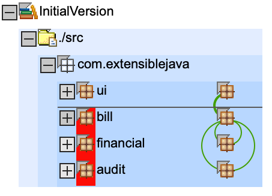

# Dependencys

[Sonargraph](https://www.hello2morrow.com/products/sonargraph) shows the cycles between packages `bill <-> financial` and `bill <-> audit` (green half circle on the right) that are in this 'InitialVersion'.

Other dependencys are fine:
* `ui` is top package that uses/sees other (lower) package `bill`
* `bill.data` is inner package of `bill` that is only used by outer package `bill`

Here we see who uses `data` package:

Here we see that the cycles between `bill <-> financial` and `bill <-> audit` are caused by class `Bill.java` in `bill`.

