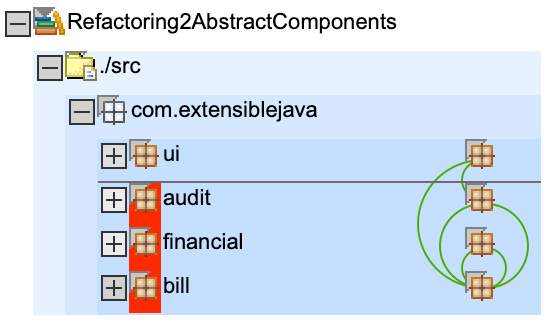
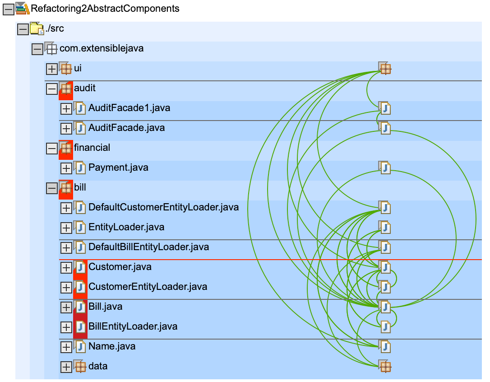

# Refactorings

* `AuditFacade` has been converted from class into interface, the implementation was moved to `AuditFacade1`. Because both file still reside in the same package `audit` nothing much has changed.
* in `build.xml` all classes from `audit` package are bundled into new `audit.jar`

# Dependencys

[Sonargraph](https://www.hello2morrow.com/products/sonargraph) shows there are still cycles between packages `bill <-> financial` and `bill <-> audit` (green half circle on the right) in this refactored version.

# Artefact

Please note: `billpay.war` now only contains the classes from `ui` package, all others are included in lib `bill.jar`

    ➜  git:(master) ✗ jar tf Refactoring2AbstractComponents/deploy/billpay.war
    META-INF/
    META-INF/MANIFEST.MF
    WEB-INF/
    WEB-INF/web.xml
    BillDetail.jsp
    CustomerBills.jsp
    search.jsp
    WEB-INF/lib/
    WEB-INF/app.tld
    WEB-INF/lib/struts.jar
    WEB-INF/struts-bean.tld
    WEB-INF/struts-config.xml
    WEB-INF/struts-form.tld
    WEB-INF/struts-html.tld
    WEB-INF/struts-logic.tld
    WEB-INF/struts-template.tld
    WEB-INF/struts.tld
    WEB-INF/lib/audit.jar       <<< notice audit.jar in WEB-INF/libs
    WEB-INF/lib/bill.jar        <<< notice bill.jar in WEB-INF/libs
    WEB-INF/classes/
    WEB-INF/classes/com/
    WEB-INF/classes/com/extensiblejava/
    WEB-INF/classes/com/extensiblejava/ui/       << notice only package ui is in war file
    WEB-INF/classes/com/extensiblejava/ui/AuditAction.class
    WEB-INF/classes/com/extensiblejava/ui/BillDetailAction.class
    WEB-INF/classes/com/extensiblejava/ui/BillDetailForm.class
    WEB-INF/classes/com/extensiblejava/ui/CustomerSearchAction.class
    WEB-INF/classes/com/extensiblejava/ui/CustomerSearchForm.class
    WEB-INF/classes/com/extensiblejava/ui/CustomerSearchResultsBean.class
    WEB-INF/classes/com/extensiblejava/ui/PayAction.class

Here is the new bill.jar file. Notice it contains packages `bill`, `financial` and `audit`

    ~ git:(master) ✗ jar tf Refactoring1PhysicalLayers/bin/bill.jar
    META-INF/
    META-INF/MANIFEST.MF
    com/
    com/extensiblejava/
    com/extensiblejava/audit/
    com/extensiblejava/bill/
    com/extensiblejava/bill/data/
    com/extensiblejava/financial/
    com/extensiblejava/audit/AuditFacade.class
    com/extensiblejava/bill/Bill.class
    com/extensiblejava/bill/BillEntityLoader.class
    com/extensiblejava/bill/Customer.class
    com/extensiblejava/bill/CustomerEntityLoader.class
    com/extensiblejava/bill/DefaultBillEntityLoader.class
    com/extensiblejava/bill/DefaultCustomerEntityLoader.class
    com/extensiblejava/bill/EntityLoader.class
    com/extensiblejava/bill/Name.class
    com/extensiblejava/bill/data/BillDataBean.class
    com/extensiblejava/bill/data/BillDb.class
    com/extensiblejava/bill/data/CustomerDataBean.class
    com/extensiblejava/financial/Payment.class

`bill.jar` contains `bill` and `financial`, NOT `audit` package

    ➜  git:(master) ✗ jar tf Refactoring2AbstractComponents/bin/bill.jar      
    META-INF/
    META-INF/MANIFEST.MF
    com/
    com/extensiblejava/
    com/extensiblejava/bill/
    com/extensiblejava/bill/data/
    com/extensiblejava/financial/
    com/extensiblejava/bill/Bill.class
    com/extensiblejava/bill/BillEntityLoader.class
    com/extensiblejava/bill/Customer.class
    com/extensiblejava/bill/CustomerEntityLoader.class
    com/extensiblejava/bill/DefaultBillEntityLoader.class
    com/extensiblejava/bill/DefaultCustomerEntityLoader.class
    com/extensiblejava/bill/EntityLoader.class
    com/extensiblejava/bill/Name.class
    com/extensiblejava/bill/data/BillDataBean.class
    com/extensiblejava/bill/data/BillDb.class
    com/extensiblejava/bill/data/CustomerDataBean.class
    com/extensiblejava/financial/Payment.class

we have a new `audit.jar` which contains `audit` package

    ➜  git:(master) jar tf Refactoring2AbstractComponents/bin/audit.jar
    META-INF/
    META-INF/MANIFEST.MF
    com/
    com/extensiblejava/
    com/extensiblejava/audit/
    com/extensiblejava/audit/AuditFacade.class
    com/extensiblejava/audit/AuditFacade1.class