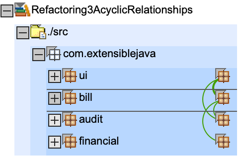
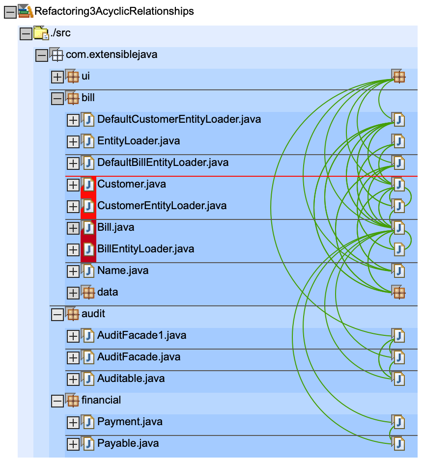

# Refactorings

* two interfaces are introduces: `Auditable` and `Payable`, `Bill` implements both, which removes all cycles between `bill <-> financial` and `bill <-> audit` :-)
* in `build.xml`
    * all classes from `audit` package are bundled into `audit.jar`
    * all classes from `bill` package are bundled into `bill.jar`
    * all classes from `financial` package are bundled into `financial.jar`

# Info

Running the ant target 'xmlanalyzerapp' produced this error:

    Invalid byte tag in constant pool 18

Looks like a Java issue, I was using Java8. Maybe this is too new? Some stackoverflow entrys suggest using Java7.

Because I used Sonargraph to visualize the dependencys, I did not investigate this issue any further.

# Dependencys

[Sonargraph](https://www.hello2morrow.com/products/sonargraph) shows there are no more cycles between packages `bill <-> financial` and `bill <-> audit`!

we have clear dependencys now:
* `bill` calls `audit`, `audit` does **not** call `bill` (it doesn't even know `bill` exists)
* `bill` calls `financial`, `financial` does **not** call `bill` (it doesn't even know `bill` exists)

# Artefact

Please note: `billpay.war` (like in previous step) only contains the classes from `ui` package, all others are included in lib `audit.jar`, `bill.jar` and `financial.jar`

    ➜ git:(master) ✗ jar tf Refactoring3AcyclicRelationships/deploy/billpay.war
    META-INF/
    META-INF/MANIFEST.MF
    WEB-INF/
    WEB-INF/web.xml
    BillDetail.jsp
    CustomerBills.jsp
    search.jsp
    WEB-INF/lib/
    WEB-INF/app.tld
    WEB-INF/lib/struts.jar
    WEB-INF/struts-bean.tld
    WEB-INF/struts-config.xml
    WEB-INF/struts-form.tld
    WEB-INF/struts-html.tld
    WEB-INF/struts-logic.tld
    WEB-INF/struts-template.tld
    WEB-INF/struts.tld
    WEB-INF/lib/audit.jar       <<< notice audit.jar in WEB-INF/lib
    WEB-INF/lib/bill.jar        <<< notice bill.jar in WEB-INF/lib
    WEB-INF/lib/financial.jar   <<< notice financial.jar in WEB-INF/lib
    WEB-INF/classes/
    WEB-INF/classes/com/
    WEB-INF/classes/com/extensiblejava/
    WEB-INF/classes/com/extensiblejava/ui/       << notice only package ui is in war file
    WEB-INF/classes/com/extensiblejava/ui/AuditAction.class
    WEB-INF/classes/com/extensiblejava/ui/BillDetailAction.class
    WEB-INF/classes/com/extensiblejava/ui/BillDetailForm.class
    WEB-INF/classes/com/extensiblejava/ui/CustomerSearchAction.class
    WEB-INF/classes/com/extensiblejava/ui/CustomerSearchForm.class
    WEB-INF/classes/com/extensiblejava/ui/CustomerSearchResultsBean.class
    WEB-INF/classes/com/extensiblejava/ui/PayAction.class

`bill.jar` contains `bill`, NOT `audit` or `financial` package

    ➜ git:(master) ✗ jar tf Refactoring3AcyclicRelationships/bin/bill.jar      
    META-INF/
    META-INF/MANIFEST.MF
    com/
    com/extensiblejava/
    com/extensiblejava/bill/
    com/extensiblejava/bill/data/
    com/extensiblejava/bill/Bill.class
    com/extensiblejava/bill/BillEntityLoader.class
    com/extensiblejava/bill/Customer.class
    com/extensiblejava/bill/CustomerEntityLoader.class
    com/extensiblejava/bill/DefaultBillEntityLoader.class
    com/extensiblejava/bill/DefaultCustomerEntityLoader.class
    com/extensiblejava/bill/EntityLoader.class
    com/extensiblejava/bill/Name.class
    com/extensiblejava/bill/data/BillDataBean.class
    com/extensiblejava/bill/data/BillDb.class
    com/extensiblejava/bill/data/CustomerDataBean.class

we have a `audit.jar` which contains `audit` package

    ➜ git:(master) jar tf Refactoring3AcyclicRelationships/bin/audit.jar
    META-INF/
    META-INF/MANIFEST.MF
    com/
    com/extensiblejava/
    com/extensiblejava/audit/
    com/extensiblejava/audit/AuditFacade.class
    com/extensiblejava/audit/AuditFacade1.class
    com/extensiblejava/audit/Auditable.class

here the new `financial.jar` with the `financial` package

    ➜ git:(master) ✗ jar tf Refactoring3AcyclicRelationships/bin/financial.jar
    META-INF/
    META-INF/MANIFEST.MF
    com/
    com/extensiblejava/
    com/extensiblejava/financial/
    com/extensiblejava/financial/Payable.class
    com/extensiblejava/financial/Payment.class