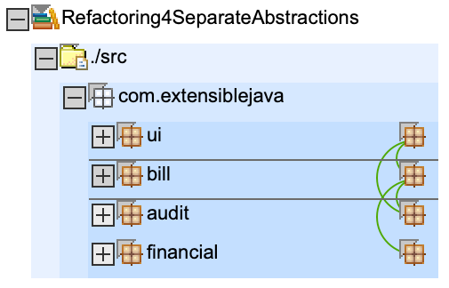
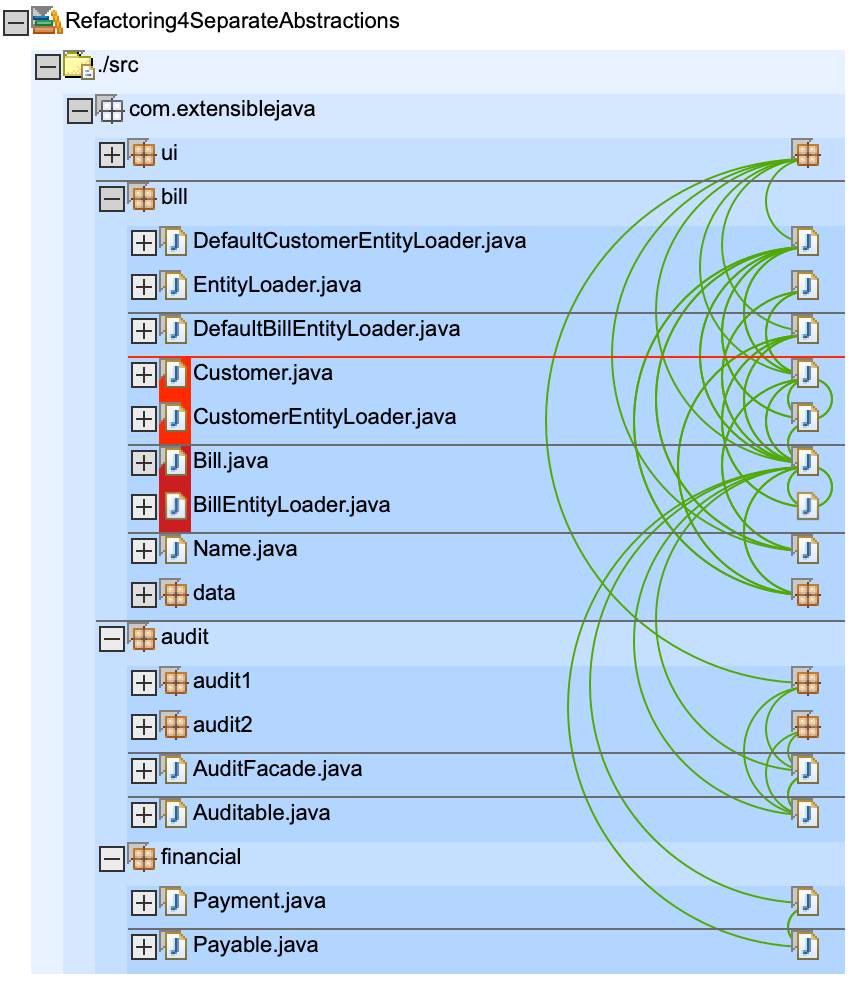

# Refactorings

* parallel to `AuditFacade1` another implementation `AuditFacade2` has been created to demonstrate multiple implementations for a single interface `AuditFacade`
* in `build.xml`
    * all classes from `audit` package (**without** subfolders `audit1` or `audit2`) are bundled into `auditspec.jar`
    * all classes from `audit1` package are bundled into `audit1.jar`
    * all classes from `audit2` package are bundled into `audit2.jar`
    * all classes from `bill` package are bundled into `bill.jar`
    * all classes from `financial` package are bundled into `financial.jar`

# Dependencys

nothing much has changed here

here we see the two new subpackages `audit1` and `audit2`. Currently only `audit1` is used (in `ui.AuditAction`)

# Artefact

Please note: `billpay.war` (like in previous step) only contains the classes from `ui` package. All others are included in the other jars.

    ➜ git:(master) ✗ jar tf Refactoring4SeparateAbstractions/deploy/billpay.war
    META-INF/
    META-INF/MANIFEST.MF
    WEB-INF/
    WEB-INF/web.xml
    BillDetail.jsp
    CustomerBills.jsp
    search.jsp
    WEB-INF/lib/
    WEB-INF/app.tld
    WEB-INF/lib/struts.jar
    WEB-INF/struts-bean.tld
    WEB-INF/struts-config.xml
    WEB-INF/struts-form.tld
    WEB-INF/struts-html.tld
    WEB-INF/struts-logic.tld
    WEB-INF/struts-template.tld
    WEB-INF/struts.tld
    WEB-INF/lib/audit1.jar      <<< notice audit1.jar in WEB-INF/lib
    WEB-INF/lib/audit2.jar      <<< notice audit2.jar in WEB-INF/lib
    WEB-INF/lib/auditspec.jar   <<< notice auditspec.jar in WEB-INF/lib
    WEB-INF/lib/bill.jar        <<< notice bill.jar in WEB-INF/lib
    WEB-INF/lib/financial.jar   <<< notice financial.jar in WEB-INF/lib
    WEB-INF/classes/
    WEB-INF/classes/com/
    WEB-INF/classes/com/extensiblejava/
    WEB-INF/classes/com/extensiblejava/ui/       << notice only package ui is in war file
    WEB-INF/classes/com/extensiblejava/ui/AuditAction.class
    WEB-INF/classes/com/extensiblejava/ui/BillDetailAction.class
    WEB-INF/classes/com/extensiblejava/ui/BillDetailForm.class
    WEB-INF/classes/com/extensiblejava/ui/CustomerSearchAction.class
    WEB-INF/classes/com/extensiblejava/ui/CustomerSearchForm.class
    WEB-INF/classes/com/extensiblejava/ui/CustomerSearchResultsBean.class
    WEB-INF/classes/com/extensiblejava/ui/PayAction.class

`bill.jar` only contains `bill`, like before

    ➜ git:(master) ✗ jar tf Refactoring4SeparateAbstractions/bin/bill.jar      
    META-INF/
    META-INF/MANIFEST.MF
    com/
    com/extensiblejava/
    com/extensiblejava/bill/
    com/extensiblejava/bill/data/
    com/extensiblejava/bill/Bill.class
    com/extensiblejava/bill/BillEntityLoader.class
    com/extensiblejava/bill/Customer.class
    com/extensiblejava/bill/CustomerEntityLoader.class
    com/extensiblejava/bill/DefaultBillEntityLoader.class
    com/extensiblejava/bill/DefaultCustomerEntityLoader.class
    com/extensiblejava/bill/EntityLoader.class
    com/extensiblejava/bill/Name.class
    com/extensiblejava/bill/data/BillDataBean.class
    com/extensiblejava/bill/data/BillDb.class
    com/extensiblejava/bill/data/CustomerDataBean.class

we have a new `auditspec.jar` which contains `audit` package, but **not** the subpackages `audit1` or `audit2`

    ➜ git:(master) jar tf Refactoring4SeparateAbstractions/bin/auditspec.jar
    META-INF/
    META-INF/MANIFEST.MF
    com/
    com/extensiblejava/
    com/extensiblejava/audit/
    com/extensiblejava/audit/AuditFacade.class
    com/extensiblejava/audit/Auditable.class

we have a new `audit1.jar` which contains the first implementation in subpackage `audit1`

    ➜ git:(master) ✗ jar tf Refactoring4SeparateAbstractions/bin/audit1.jar   
    META-INF/
    META-INF/MANIFEST.MF
    com/
    com/extensiblejava/
    com/extensiblejava/audit/
    com/extensiblejava/audit/audit1/
    com/extensiblejava/audit/audit1/AuditFacade1.class

we have a new `audit2.jar` which contains the second implementation in subpackage `audit2`

    ➜ git:(master) ✗ jar tf Refactoring4SeparateAbstractions/bin/audit2.jar   
    META-INF/
    META-INF/MANIFEST.MF
    com/
    com/extensiblejava/
    com/extensiblejava/audit/
    com/extensiblejava/audit/audit2/
    com/extensiblejava/audit/audit2/AuditFacade2.class

here the `financial.jar`, unchanged to previous step

    ➜ git:(master) ✗ jar tf Refactoring4SeparateAbstractions/bin/financial.jar
    META-INF/
    META-INF/MANIFEST.MF
    com/
    com/extensiblejava/
    com/extensiblejava/financial/
    com/extensiblejava/financial/Payable.class
    com/extensiblejava/financial/Payment.class