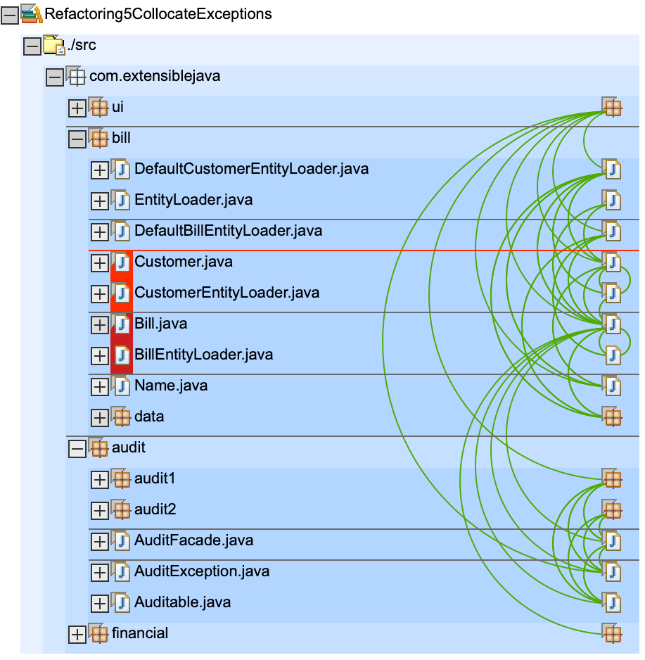

# Refactorings

* now in `audit` package an exception is added `AuditException` which is thrown in `AuditFacade` and has to be handled by callers
* in `build.xml`: no changes

# Dependencys

nothing much has changed here

here we see the new exception `AuditException` which gets referenced quite a lot from `bill` and `ui`

# Artefact

`billpay.war`: no changes

`bill.jar` only contains `bill`, no changes

`auditspec.jar` which (only) contains `audit` package, now contains the new `AuditException`

    ➜ git:(master) jar tf Refactoring4SeparateAbstractions/bin/auditspec.jar
    META-INF/
    META-INF/MANIFEST.MF
    com/
    com/extensiblejava/
    com/extensiblejava/audit/
    com/extensiblejava/audit/AuditException.class
    com/extensiblejava/audit/AuditFacade.class
    com/extensiblejava/audit/Auditable.class

`audit1.jar`, `audit2.jar`, `financial.jar`, unchanged to previous step
