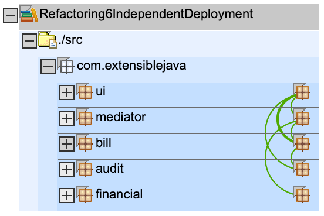
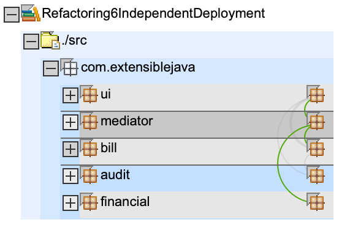
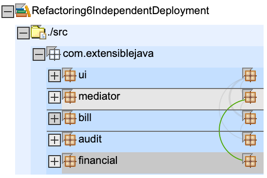
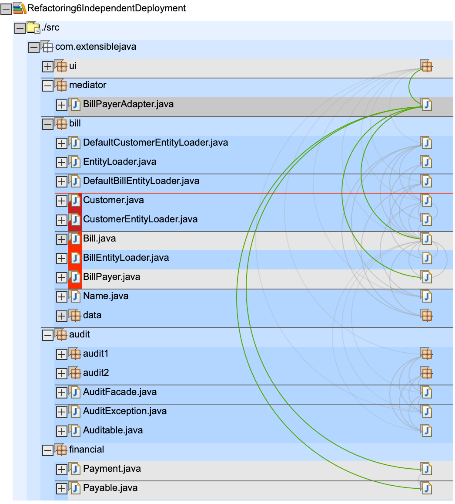

# Refactorings

* now a new package `mediator` is introduced with a new class `BillPayerAdapter` which handles the dependency from `bill` to `financial`
* in `build.xml`: no changes

# Dependencys

we see a new package `mediator`

if we select it we can see that it calls/uses packages `bill` and `financial`.
If you look carefully you see that `bill` does not depend on `financial` any longer, the dependency has been moved to `mediator` package

if we select `financial` we see that it is only called by `mediator`, **not** `bill` anymore

here we see which classes are used by `BillPayerAdapter` (follow the green half circles)

# Artefact

`billpay.war`: now contains `billpay.jar` which contains `mediator.BillPayerAdapter`

    ➜ git:(master) ✗ jar tf Refactoring6IndependentDeployment/deploy/billpay.war
    META-INF/
    META-INF/MANIFEST.MF
    WEB-INF/
    WEB-INF/web.xml
    BillDetail.jsp
    CustomerBills.jsp
    search.jsp
    WEB-INF/lib/
    WEB-INF/app.tld
    WEB-INF/lib/struts.jar
    WEB-INF/struts-bean.tld
    WEB-INF/struts-config.xml
    WEB-INF/struts-form.tld
    WEB-INF/struts-html.tld
    WEB-INF/struts-logic.tld
    WEB-INF/struts-template.tld
    WEB-INF/struts.tld
    WEB-INF/lib/audit1.jar
    WEB-INF/lib/audit2.jar
    WEB-INF/lib/auditspec.jar
    WEB-INF/lib/bill.jar
    WEB-INF/lib/billpay.jar      << notice billpay.jar has been added
    WEB-INF/lib/financial.jar
    WEB-INF/classes/
    WEB-INF/classes/com/
    WEB-INF/classes/com/extensiblejava/
    WEB-INF/classes/com/extensiblejava/ui/
    WEB-INF/classes/com/extensiblejava/ui/AuditAction.class
    WEB-INF/classes/com/extensiblejava/ui/BillDetailAction.class
    WEB-INF/classes/com/extensiblejava/ui/BillDetailForm.class
    WEB-INF/classes/com/extensiblejava/ui/CustomerSearchAction.class
    WEB-INF/classes/com/extensiblejava/ui/CustomerSearchForm.class
    WEB-INF/classes/com/extensiblejava/ui/CustomerSearchResultsBean.class
    WEB-INF/classes/com/extensiblejava/ui/PayAction.class

`billpay.jar` contains the `mediator` package

    ➜ git:(master) ✗ jar tf Refactoring6IndependentDeployment/bin/billpay.jar
    META-INF/
    META-INF/MANIFEST.MF
    com/
    com/extensiblejava/
    com/extensiblejava/mediator/
    com/extensiblejava/mediator/BillPayerAdapter.class

other jars are unchanged to previous step
