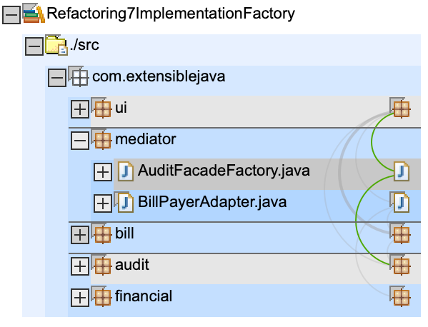

# Refactorings

* in package `mediator` a new class `AuditFacadeFactory` is introduced to decouple the `ui` from the creation of `AuditFacade1` instances
* in `build.xml`: no changes

# Info

I did not check / clean up subfolder `restaudit`. It is not mentioned in the book, I have no idea what this is about. I deleted it. If you want to check it out, please look in original repo that I forked off of.

# Dependencys

we see a new `AuditFacadeFactory` in package `mediator`

# Artefact

`billpay.war`: now contains `billpay.jar` which contains `mediator.BillPayerAdapter`

    ➜ git:(master) ✗ jar tf Refactoring6IndependentDeployment/deploy/billpay.war
    META-INF/
    META-INF/MANIFEST.MF
    WEB-INF/
    WEB-INF/web.xml
    BillDetail.jsp
    CustomerBills.jsp
    search.jsp
    WEB-INF/lib/
    WEB-INF/app.tld
    WEB-INF/lib/struts.jar
    WEB-INF/struts-bean.tld
    WEB-INF/struts-config.xml
    WEB-INF/struts-form.tld
    WEB-INF/struts-html.tld
    WEB-INF/struts-logic.tld
    WEB-INF/struts-template.tld
    WEB-INF/struts.tld
    WEB-INF/lib/audit1.jar
    WEB-INF/lib/audit2.jar
    WEB-INF/lib/auditspec.jar
    WEB-INF/lib/bill.jar
    WEB-INF/lib/billpay.jar      << notice billpay.jar has been added
    WEB-INF/lib/financial.jar
    WEB-INF/classes/
    WEB-INF/classes/com/
    WEB-INF/classes/com/extensiblejava/
    WEB-INF/classes/com/extensiblejava/ui/
    WEB-INF/classes/com/extensiblejava/ui/AuditAction.class
    WEB-INF/classes/com/extensiblejava/ui/BillDetailAction.class
    WEB-INF/classes/com/extensiblejava/ui/BillDetailForm.class
    WEB-INF/classes/com/extensiblejava/ui/CustomerSearchAction.class
    WEB-INF/classes/com/extensiblejava/ui/CustomerSearchForm.class
    WEB-INF/classes/com/extensiblejava/ui/CustomerSearchResultsBean.class
    WEB-INF/classes/com/extensiblejava/ui/PayAction.class

`billpay.jar` contains the `mediator` package, which now also contains `AuditFacadeFactory`

    ➜ git:(master) ✗ jar tf Refactoring6IndependentDeployment/bin/billpay.jar
    META-INF/
    META-INF/MANIFEST.MF
    com/
    com/extensiblejava/
    com/extensiblejava/mediator/
    com/extensiblejava/mediator/AuditFacadeFactory.class
    com/extensiblejava/mediator/BillPayerAdapter.class

other jars are unchanged to previous step
